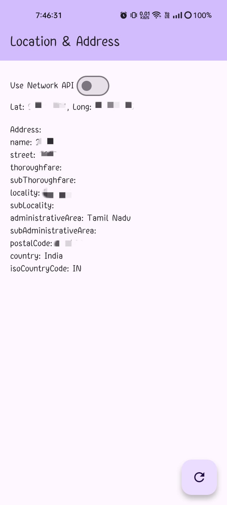
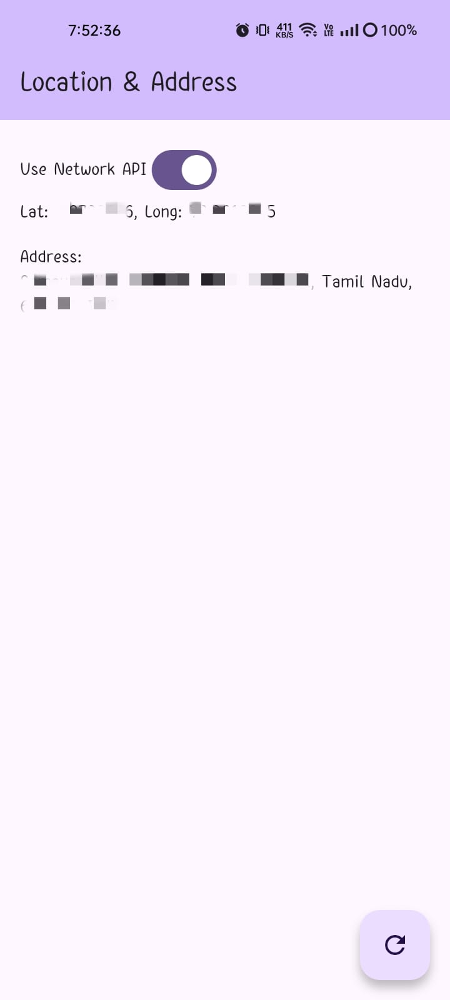
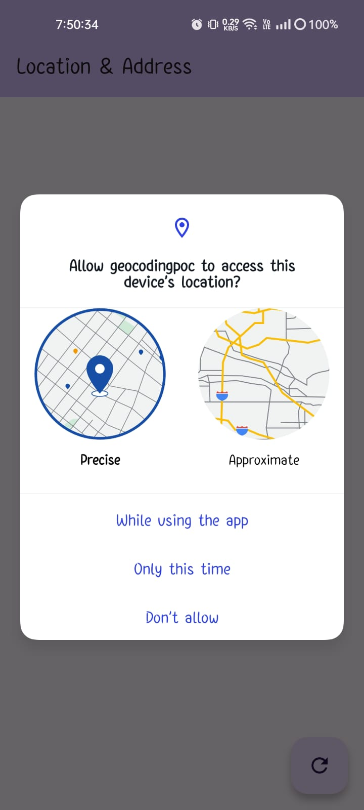
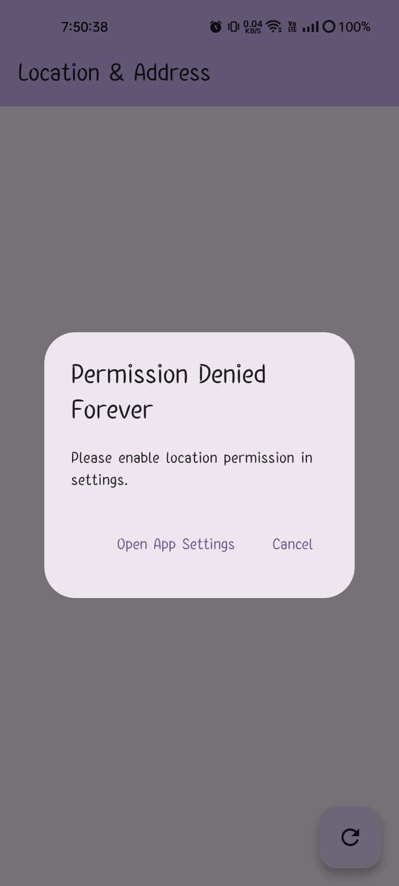
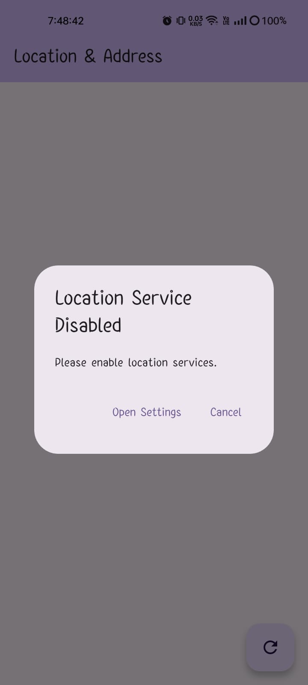

# 📍 Flutter Location & Address Finder

This Flutter app fetches the user’s current location and converts it into a readable address using either the **Geocoding** package or the **Nominatim OpenStreetMap API**.

---

## ✨ Features

- ✅ Get user’s current location using `geolocator`
- ✅ Reverse geocoding using:
  - 📍 Flutter `geocoding` package (offline-based)
  - 🌐 OpenStreetMap Nominatim API (network-based)
- ✅ Auto retry (5 times) for network-based address fetch
- ✅ Handles permission and location service logic
- ✅ Auto-detect if user returns from system permission screen
- ✅ Toggle switch to choose between Geocoding or Network API
- ✅ Clean UI with readable address output
- ✅ Error handling and fallback support

---

## 📸 Screenshots

| Feature                             | Screenshot                          |
|-------------------------------------|-------------------------------------|
| Address display - Using Geocoding   |  |
| Address display - Using Network     |  |
| Permission handeing                 |  |
| Location permission handeling       |  |
| Location service handeling          |  |

---

## 📦 Packages Used

| Package        | Usage                               |
|----------------|-------------------------------------|
| `geolocator`   | Get current location                |
| `geocoding`    | Convert lat/lng to address locally  |
| `http`         | Call Nominatim reverse geocoding API |
| `permission_handler` (optional) | Manage system-level permissions |

---

## 🌐 API (Network Option)

**OpenStreetMap Nominatim API** is used for network-based address conversion.

- **URL**:  
  `https://nominatim.openstreetmap.org/reverse?format=json&lat={LAT}&lon={LON}`

- **Request type**: `GET`
- **Headers**:
  ```http
  User-Agent: YourAppName (your_email@example.com)
